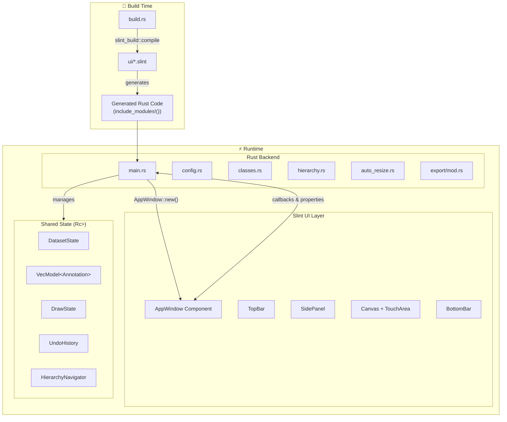
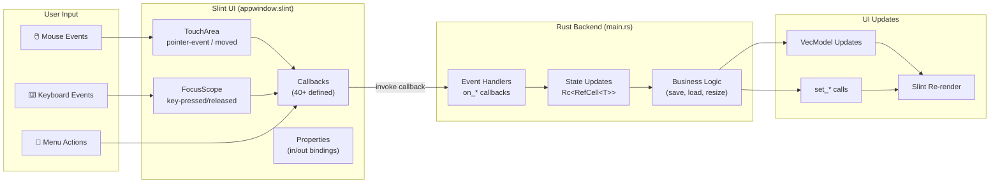
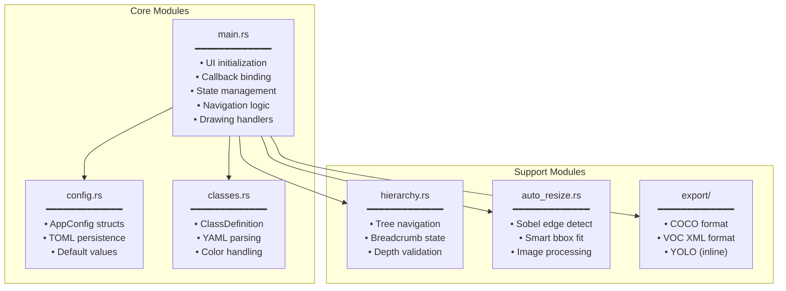
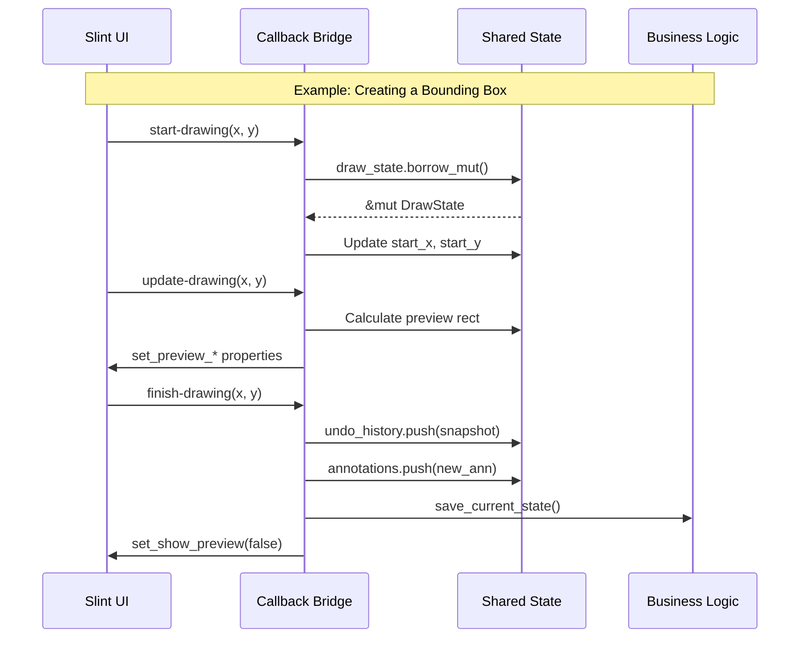
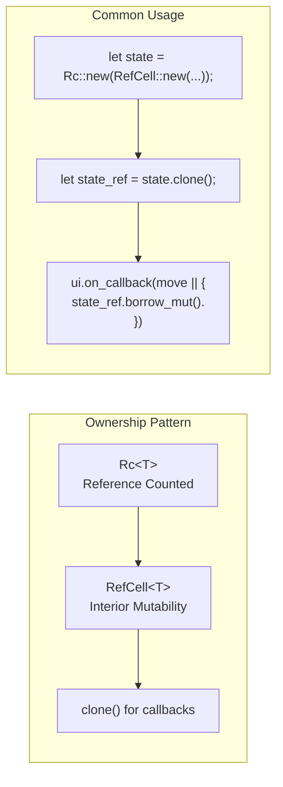
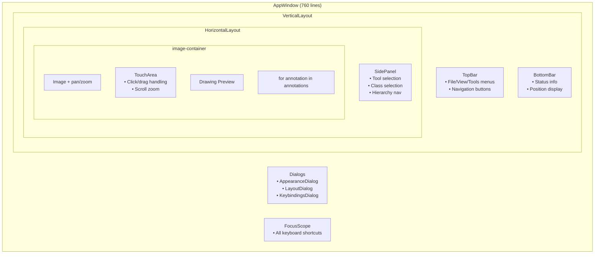

# RADICAL Image Annotator - Architecture Documentation

This document explains how the Rust and Slint code work together in this image annotation tool, with architecture diagrams and improvement recommendations.

## High-Level Architecture



## Data Flow Architecture



## Module Responsibilities



## Slint-Rust Callback Pattern



## State Management Pattern



## UI Component Hierarchy



---

## Improvement Proposals

### 1. **Split main.rs into Multiple Modules** ⭐ High Priority

**Problem**: `main.rs` is 2,266 lines with 40+ callback handlers, making it hard to navigate and maintain.

**Proposed Structure**:
```
src/
├── main.rs              # Entry point, initialization (~100 lines)
├── app.rs               # AppWindow setup and state wiring (~200 lines)
├── callbacks/
│   ├── mod.rs           # Re-exports
│   ├── navigation.rs    # next/prev/first/last image handlers
│   ├── drawing.rs       # start/update/finish drawing
│   ├── annotation.rs    # select, delete, classify handlers  
│   ├── resize.rs        # start/update/finish resize
│   └── file.rs          # open, save, export handlers
├── state/
│   ├── mod.rs
│   ├── dataset.rs       # DatasetState, DatasetEntry
│   ├── undo.rs          # UndoHistory
│   └── view.rs          # ViewState, DrawState, ResizeState
└── (existing modules...)
```

### 2. **Extract Annotation Types to Dedicated Module** ⭐ Medium Priority

**Problem**: Annotation handling logic (parsing, saving, rendering) is scattered throughout `main.rs`.

**Proposed Solution**:
```rust
// src/annotation/mod.rs
pub struct AnnotationManager {
    model: Rc<VecModel<Annotation>>,
    undo: Rc<RefCell<UndoHistory>>,
}

impl AnnotationManager {
    pub fn add(&self, ann: Annotation) { ... }
    pub fn delete(&self, index: usize) { ... }
    pub fn select(&self, index: usize) { ... }
    pub fn snapshot(&self) -> Vec<Annotation> { ... }
    pub fn restore(&self, snapshot: Vec<Annotation>) { ... }
}
```

### 3. **Use Slint Globals for Shared State** ⭐ Medium Priority

**Problem**: Currently, state like `current-tool` and `current-class` is managed via properties passed between components.

**Proposed Solution**:
```slint
// ui/globals.slint
export global AppState {
    in-out property <string> current-tool: "Neutral";
    in-out property <int> current-class: 1;
    in-out property <bool> is-drawing: false;
    in-out property <float> zoom-level: 1.0;
}
```

Benefits:
- Any component can access state directly
- Reduces property drilling through component hierarchy
- Cleaner Rust code (single point of state access)

### 4. **Implement Command Pattern for Undo/Redo** 🔄 Nice to Have

**Problem**: Current undo stores full annotation snapshots, which is memory-inefficient.

**Proposed Solution**:
```rust
enum Command {
    AddAnnotation { annotation: Annotation },
    DeleteAnnotation { index: usize, annotation: Annotation },
    ModifyAnnotation { index: usize, old: Annotation, new: Annotation },
    BatchCommand { commands: Vec<Command> },
}

impl Command {
    fn execute(&self, model: &VecModel<Annotation>) { ... }
    fn undo(&self, model: &VecModel<Annotation>) { ... }
}
```

### 5. **Add Error Handling with thiserror** 🔄 Nice to Have

**Problem**: Error handling uses `Result<T, String>` throughout, losing type information.

**Proposed Solution**:
```rust
// src/error.rs
#[derive(thiserror::Error, Debug)]
pub enum AppError {
    #[error("Failed to load dataset: {0}")]
    DatasetLoad(String),
    
    #[error("Image not found: {path}")]
    ImageNotFound { path: PathBuf },
    
    #[error("Export failed: {0}")]
    Export(#[from] std::io::Error),
}
```

### 6. **Lazy Image Loading for Large Datasets** ⭐ High Priority

**Problem**: All images are loaded synchronously, causing delays with large datasets.

**Proposed Solution**:
```rust
// Async image preloading
struct ImageCache {
    loaded: HashMap<usize, slint::Image>,
    loading: HashSet<usize>,
}

// Preload adjacent images in background
fn preload_adjacent(&self, current: usize, range: usize) {
    for i in current.saturating_sub(range)..=current + range {
        if !self.loaded.contains_key(&i) {
            // Spawn async task to load
        }
    }
}
```

### 7. **Type-Safe Tool Selection** 🔄 Nice to Have

**Problem**: Tools are identified by magic strings like `"BBox (B)"`, `"Point (C)"`.

**Proposed Solution**:
```rust
#[derive(Clone, PartialEq)]
enum Tool {
    Neutral,
    BBox,
    Point,
    Polygon,
    RotatedBBox,
}

impl Tool {
    fn to_display_string(&self) -> &'static str {
        match self {
            Tool::BBox => "BBox (B)",
            // ...
        }
    }
}
```

---

## Priority Summary

| Priority | Improvement | Impact | Effort |
|----------|-------------|--------|--------|
| ⭐ High | Split main.rs | Maintainability | Medium |
| ⭐ High | Lazy image loading | Performance | Medium |
| ⭐ Medium | Extract AnnotationManager | Code organization | Low |
| ⭐ Medium | Slint Globals for state | Clean architecture | Low |
| 🔄 Nice | Command pattern undo | Memory efficiency | High |
| 🔄 Nice | thiserror for errors | Developer experience | Low |
| 🔄 Nice | Type-safe Tool enum | Type safety | Low |

---

## Quick Reference: Key Integration Points

| Slint → Rust | Rust → Slint |
|--------------|--------------|
| `callback name(args)` | `ui.on_name(move \|args\| { ... })` |
| In Slint: `root.name()` | `ui.invoke_name()` |

| Rust → Slint | |
|--------------|--------------|
| Set property | `ui.set_property_name(value)` |
| Get property | `ui.get_property_name()` |
| Update model | `model.push(item)`, `model.set_row_data(i, item)` |

