# RADICAL Image Annotator - Architecture Documentation (v3)

This document explains the current refactored architecture of the Rust + Slint image annotation tool, with updated diagrams reflecting the modular callback and state structure.

## High-Level Architecture


## File Structure Overview


## Data Flow Architecture

```mermaid
flowchart LR
    subgraph Input["User Input"]
        Mouse["🖱️ Mouse Events"]
        Keyboard["⌨️ Keyboard Events"]
        Menu["📁 Menu Actions"]
    end

    subgraph SlintLayer["Slint UI (appwindow.slint)"]
        TouchArea["TouchArea<br/>pointer-event / moved"]
        FocusScope["FocusScope<br/>key-pressed/released"]
        Callbacks["Callbacks<br/>(40+ defined)"]
        Properties["Properties<br/>(in/out bindings)"]
    end

    subgraph RustLayer["Rust Backend"]
        subgraph MainRS["main.rs"]
            EventHandler["Callback Registration<br/>on_* handlers"]
        end
        
        subgraph CBModules["callbacks/"]
            NavHandlers["navigation.rs"]
            SelectHandlers["selection.rs"]
            DrawHandlers["drawing.rs"]
            AnnHandlers["annotation.rs"]
            PolyHandlers["polygon.rs"]
            ResizeHandlers["resize.rs"]
            FileHandlers["file_ops.rs"]
        end
        
        subgraph StateModules["state/"]
            StateUpdate["Dataset + Types<br/>Rc&lt;RefCell&lt;T&gt;&gt;"]
        end
    end

    subgraph Output["UI Updates"]
        ModelUpdate["VecModel Updates"]
        PropertySet["set_* calls"]
        Rerender["Slint Re-render"]
    end

    Mouse --> TouchArea --> Callbacks
    Keyboard --> FocusScope --> Callbacks
    Menu --> Callbacks
    Callbacks -->|"invoke callback"| EventHandler
    EventHandler --> CBModules
    CBModules --> StateUpdate
    StateUpdate --> ModelUpdate & PropertySet
    ModelUpdate & PropertySet --> Rerender
```



## Module Responsibilities

```mermaid
graph TB
    subgraph core["Core Modules"]
        main["main.rs<br/>━━━━━━━━━━━━━<br/>• UI initialization<br/>• Callback registration<br/>• State setup<br/>~495 lines (was 2,266)"]
        
        config["config.rs<br/>━━━━━━━━━━━━━<br/>• AppConfig structs<br/>• TOML persistence<br/>• Default values"]
        
        classes["classes.rs<br/>━━━━━━━━━━━━━<br/>• ClassDefinition<br/>• YAML parsing<br/>• Color handling"]
    end
    
    subgraph callbacks["Callback Modules (NEW)"]
        navigation["navigation.rs<br/>━━━━━━━━━━━━━<br/>• Image navigation<br/>• Index management<br/>• Wrap-around logic"]
        
        selection["selection.rs<br/>━━━━━━━━━━━━━<br/>• Annotation selection<br/>• Multi-select<br/>• Deselect all"]
        
        drawing["drawing.rs<br/>━━━━━━━━━━━━━<br/>• BBox creation<br/>• Point annotation<br/>• Preview handling"]
        
        annotation["annotation.rs<br/>━━━━━━━━━━━━━<br/>• Delete/classify<br/>• Undo/redo<br/>• Copy/paste"]
        
        polygon["polygon.rs<br/>━━━━━━━━━━━━━<br/>• Polygon creation<br/>• Vertex management<br/>• Close polygon"]
        
        resize["resize.rs<br/>━━━━━━━━━━━━━<br/>• Resize operations<br/>• Corner/edge anchors<br/>• Constraint handling"]
        
        file_ops["file_ops.rs<br/>━━━━━━━━━━━━━<br/>• Open/save dialogs<br/>• Export operations<br/>• Dataset loading"]
    end
    
    subgraph state_mod["State Modules (NEW)"]
        types["types.rs<br/>━━━━━━━━━━━━━<br/>• DrawState<br/>• ResizeState<br/>• ViewState<br/>• UndoHistory"]
        
        dataset["dataset.rs<br/>━━━━━━━━━━━━━<br/>• DatasetState<br/>• DatasetEntry<br/>• Annotation I/O<br/>• YOLO format"]
    end
    
    subgraph support["Support Modules"]
        hierarchy["hierarchy.rs<br/>━━━━━━━━━━━━━<br/>• Tree navigation<br/>• Breadcrumb state<br/>• Depth validation"]
        
        auto_resize_mod["auto_resize.rs<br/>━━━━━━━━━━━━━<br/>• Sobel edge detect<br/>• Smart bbox fit<br/>• Image processing"]
        
        export_mod["export/<br/>━━━━━━━━━━━━━<br/>• COCO format<br/>• VOC XML format<br/>• YOLO (in state)"]
    end
    
    main --> callbacks
    main --> state_mod
    main --> config & classes
    main --> hierarchy & auto_resize_mod & export_mod
```



## Callback Module Detail

```mermaid
flowchart TB
    subgraph callbacks["callbacks/ Module"]
        mod["mod.rs<br/>Public re-exports"]
        
        subgraph nav["navigation.rs"]
            nav_fn["register_navigation_callbacks()<br/>• setup_next_image<br/>• setup_prev_image<br/>• setup_first_image<br/>• setup_last_image<br/>• setup_random_image"]
        end
        
        subgraph sel["selection.rs"]
            sel_fn["register_selection_callbacks()<br/>• setup_select_annotation<br/>• setup_deselect_all<br/>• setup_select_all"]
        end
        
        subgraph draw["drawing.rs"]
            draw_fn["register_drawing_callbacks()<br/>• setup_start_drawing<br/>• setup_update_drawing<br/>• setup_finish_drawing"]
        end
        
        subgraph ann["annotation.rs"]
            ann_fn["register_annotation_callbacks()<br/>• setup_delete_annotation<br/>• setup_classify_annotation<br/>• setup_undo/setup_redo<br/>• setup_copy/setup_paste"]
        end
        
        subgraph poly["polygon.rs"]
            poly_fn["register_polygon_callbacks()<br/>• setup_polygon_add_vertex<br/>• setup_polygon_close<br/>• setup_polygon_cancel"]
        end
        
        subgraph rsz["resize.rs"]
            rsz_fn["register_resize_callbacks()<br/>• setup_start_resize<br/>• setup_update_resize<br/>• setup_finish_resize"]
        end
        
        subgraph file["file_ops.rs"]
            file_fn["register_file_callbacks()<br/>• setup_save<br/>• setup_open<br/>• setup_export_coco<br/>• setup_export_voc"]
        end
        
        subgraph auto["auto_resize.rs"]
            auto_fn["register_auto_resize_callbacks()<br/>• setup_auto_resize_bbox<br/>• edge detection logic"]
        end
    end
    
    mod --> nav & sel & draw & ann & poly & rsz & file & auto
```



## State Module Detail

```mermaid
flowchart TB
    subgraph state["state/ Module"]
        mod["mod.rs<br/>Re-exports types.rs and dataset.rs"]
        
        subgraph types["types.rs"]
            ViewState["ViewState<br/>• offset_x, offset_y<br/>• zoom<br/>• pan tracking"]
            
            DrawState["DrawState<br/>• start_x, start_y<br/>• current tool<br/>• preview state"]
            
            ResizeState["ResizeState<br/>• target annotation<br/>• anchor position<br/>• original coords"]
            
            UndoHistory["UndoHistory<br/>• undo_stack: Vec<br/>• redo_stack: Vec<br/>• push/pop methods"]
            
            StoredAnnotation["StoredAnnotation<br/>• Serializable format<br/>• Type, coords, class"]
        end
        
        subgraph dataset["dataset.rs"]
            DatasetState["DatasetState<br/>• entries: Vec<DatasetEntry><br/>• current_index<br/>• base_path"]
            
            DatasetEntry["DatasetEntry<br/>• image_path<br/>• label_path<br/>• is_annotated flag"]
            
            Functions["Functions<br/>• load_yolo_annotations()<br/>• save_current_state()<br/>• replace_annotations()<br/>• next_id_from_annotations()"]
        end
    end
    
    mod --> types & dataset
```



## Slint-Rust Callback Pattern


## State Management Pattern


## UI Component Hierarchy

```mermaid
graph TB
    subgraph AppWindow["AppWindow (~42KB)"]
        subgraph Layout["VerticalLayout"]
            TopBar2["TopBar<br/>• File/View/Tools menus<br/>• Navigation buttons"]
            
            subgraph HLayout["HorizontalLayout"]
                SidePanel2["SidePanel<br/>• Tool selection<br/>• Class selection<br/>• Hierarchy nav"]
                
                subgraph Canvas2["image-container"]
                    Image["Image + pan/zoom"]
                    TouchArea2["TouchArea<br/>• Click/drag handling<br/>• Scroll zoom"]
                    Preview["Drawing Preview"]
                    Annotations2["for annotation in annotations"]
                end
            end
            
            BottomBar2["BottomBar<br/>• Status info<br/>• Position display"]
        end
        
        Dialogs["Dialogs<br/>• AppearanceDialog<br/>• LayoutDialog<br/>• KeybindingsDialog"]
        
        FocusScope2["FocusScope<br/>• All keyboard shortcuts"]
    end
```



---

## Architecture Improvements Completed ✅

The following improvements from readme2.md have been **implemented**:

### 1. ✅ Split main.rs into Multiple Modules

**Before**: `main.rs` was 2,266 lines with 40+ callback handlers.

**After**: 
- `main.rs` reduced to ~495 lines (entry point + state setup)
- `callbacks/` module with 8 specialized files:
  - `navigation.rs` - Image navigation handlers
  - `selection.rs` - Annotation selection handlers
  - `drawing.rs` - Drawing operation handlers
  - `annotation.rs` - Annotation manipulation handlers
  - `polygon.rs` - Polygon-specific handlers
  - `resize.rs` - Resize operation handlers
  - `file_ops.rs` - File I/O handlers
  - `auto_resize.rs` - Smart resize handlers

### 2. ✅ Extract State Types to Dedicated Module

**Before**: State types were scattered in main.rs.

**After**: `state/` module with organized files:
- `types.rs` - DrawState, ResizeState, ViewState, UndoHistory, StoredAnnotation
- `dataset.rs` - DatasetState, DatasetEntry, annotation I/O functions

---

## Remaining Improvement Proposals

### 1. **Use Slint Globals for Shared State** ⭐ Medium Priority

```slint
// ui/globals.slint
export global AppState {
    in-out property <string> current-tool: "Neutral";
    in-out property <int> current-class: 1;
    in-out property <bool> is-drawing: false;
    in-out property <float> zoom-level: 1.0;
}
```

### 2. **Implement Command Pattern for Undo/Redo** 🔄 Nice to Have

```rust
enum Command {
    AddAnnotation { annotation: Annotation },
    DeleteAnnotation { index: usize, annotation: Annotation },
    ModifyAnnotation { index: usize, old: Annotation, new: Annotation },
}
```

### 3. **Lazy Image Loading for Large Datasets** ⭐ High Priority

```rust
struct ImageCache {
    loaded: HashMap<usize, slint::Image>,
    loading: HashSet<usize>,
}
```

### 4. **Type-Safe Tool Selection** 🔄 Nice to Have

```rust
enum Tool {
    Neutral,
    BBox,
    Point,
    Polygon,
    RotatedBBox,
}
```

---

## Priority Summary (Updated)

| Priority | Improvement | Status | Impact |
|----------|-------------|--------|--------|
| ✅ Done | Split main.rs | **Completed** | Maintainability |
| ✅ Done | Extract state types | **Completed** | Code organization |
| ⭐ High | Lazy image loading | Pending | Performance |
| ⭐ Medium | Slint Globals | Pending | Clean architecture |
| 🔄 Nice | Command pattern undo | Pending | Memory efficiency |
| 🔄 Nice | Type-safe Tool enum | Pending | Type safety |

---

## Quick Reference: Key Integration Points

| Slint → Rust | Rust → Slint |
|--------------|--------------|
| `callback name(args)` | `ui.on_name(move \|args\| { ... })` |
| In Slint: `root.name()` | `ui.invoke_name()` |

| Rust → Slint | |
|--------------|-|
| Set property | `ui.set_property_name(value)` |
| Get property | `ui.get_property_name()` |
| Update model | `model.push(item)`, `model.set_row_data(i, item)` |
